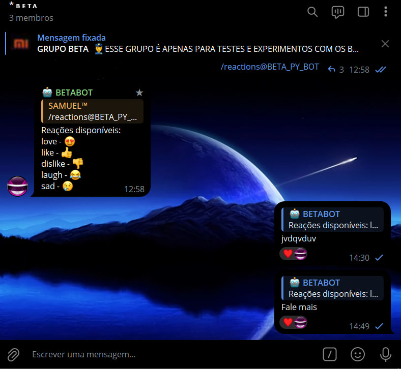
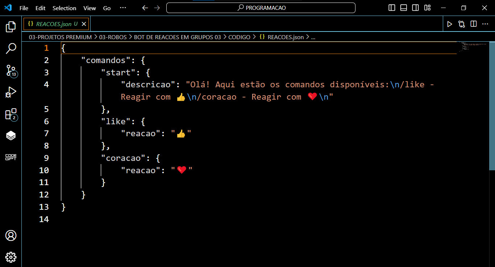

# BOT DE REACOES EM GRUPOS 03
🛑ESTE BOT TELEGRAM É PROJETADO PARA REAGIR A MENSAGENS COM EMOJIS BASEADOS EM COMANDOS DEFINIDOS PELO USUÁRIO.

 <br>
 <br>

## DESCRIÇÃO:
Este bot Telegram é projetado para reagir a mensagens com emojis baseados em comandos definidos pelo usuário. Ele permite uma fácil customização dos comandos e das reações através de um arquivo JSON (`REACOES.json`). O objetivo principal é fornecer uma interface simples para adicionar novos comandos e reações sem a necessidade de modificar o código principal do bot.

## FUNCIONALIDADES:
1. **Comando `/start`**:
   - Quando o usuário envia o comando `/start`, o bot responde com uma mensagem de boas-vindas que lista os comandos disponíveis.
   - A mensagem é carregada do arquivo `REACOES.json`, permitindo que ela seja facilmente modificada conforme necessário.

2. **Reação a Comandos Personalizados**:
   - O bot pode reagir a uma mensagem com emojis específicos quando o usuário envia comandos personalizados.
   - Esses comandos e as reações associadas são definidos no arquivo `REACOES.json`, permitindo uma fácil extensão e personalização.

3. **Configuração Dinâmica de Comandos**:
   - O bot carrega todos os comandos e suas reações do arquivo `REACOES.json` ao iniciar.
   - Isso permite adicionar, remover ou modificar comandos e suas reações simplesmente editando o arquivo JSON, sem a necessidade de alterar o código do bot.

## PROCEDIMENTO DE COMPRA:
- Para efetuar a compra, por favor, entre em contato comigo por mensagem privada, informando:
    ```bash
    Gostaria de adquirir o bot: https://github.com/VILHALVA/BOT-DE-REACOES-EM-GRUPOS-03
    ```
- Após a confirmação do pagamento e o envio do comprovante, você receberá um arquivo zip contendo o código-fonte do bot, acompanhado de um manual detalhado (`MANUAL.md`), que oferece instruções abrangentes sobre a configuração do ambiente, sugestões de cursos e documentação recomendada, bem como o arquivo `HOSPEDAGEM.md`, contendo orientações para hospedar o seu bot.

- [🤑CLIQUE AQUI PARA ENTRAR EM CONTATO](https://t.me/VILHALVA100)
- [🧑‍💻PRECISA DE UM FREELANCER? CLIQUE AQUI PARA VER EM TELEGRAPH](https://telegra.ph/FREELANCER-10-19-9)
- [🧑‍💻PRECISA DE UM FREELANCER? CLIQUE AQUI PARA VER EM README](https://github.com/VILHALVA/VILHALVA/blob/main/FREELANCER/README.md)