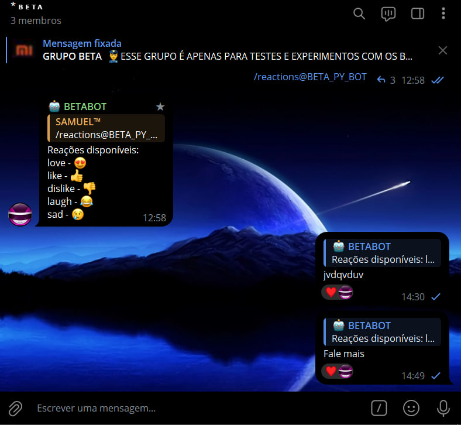

# BOT DE REACOES EM GRUPOS
🔐ESSE É UM BOT DO TELEGRAM QUE REAJE A UMA MENSAGEM MENCIONADA!

  

## DESCRIÇÃO:
Este é um bot para Telegram que permite aos usuários reagirem às mensagens em um grupo com emojis específicos. 

**Comandos Disponíveis:**
   - `/start`: Inicia o bot e exibe os comandos disponíveis.
   - `/like`: Reage a uma mensagem com o emoji de polegar para cima (👍).
   - `/coracao`: Reage a uma mensagem com o emoji de coração (❤️).

## COMPRAR:
- [🤑GOSTOU DESSE PROJETO? CLIQUE AQUI PARA COMPRAR.](https://github.com/VILHALVA/VILHALVA/blob/main/FREELANCER/README.md)